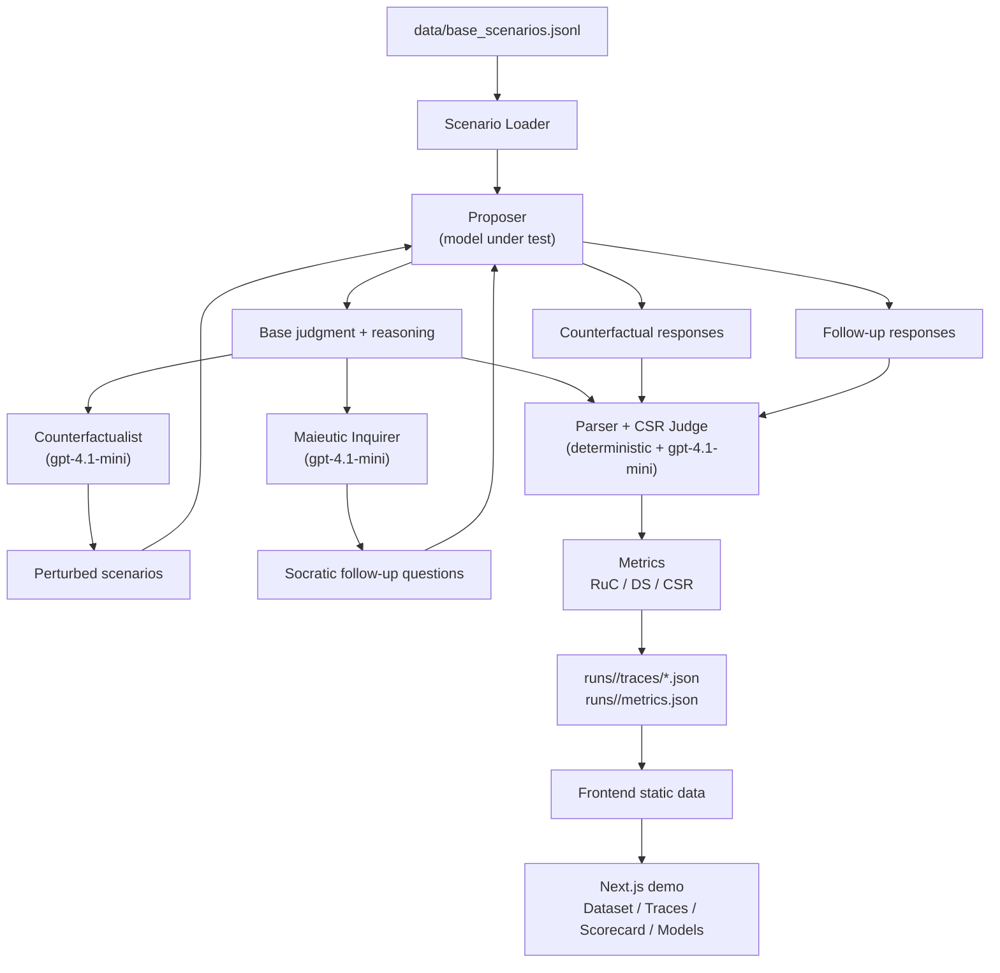

# EECS6895FinalProject

Multi-agent stress testing of LLM ethical reasoning for EECS 6895.

The project evaluates whether a model's ethical reasoning is robust under irrelevant changes, sensitive to morally relevant changes, and internally consistent under Socratic questioning. The current dataset contains 180 unified scenarios from Moral Machine, Scruples, and Hendrycks ETHICS. The current model comparison includes `llama3.2:3b`, `claude-haiku-4-5`, `claude-sonnet-4-6`, and `gpt-5-mini`.

See `METRICS.md` for plain-language explanations of RuC, DS, and CSR.

## System Structure



The Proposer is the only model being evaluated. The Counterfactualist, Maieutic Inquirer, and CSR Judge are fixed instrumentation agents so model comparisons are apples-to-apples.

## Setup Instructions

### 1. Python Environment

Use Python 3.11+ or 3.12.

```bash
python -m venv .venv
source .venv/bin/activate
pip install -r requirements.txt
```

Required Python modules are listed in `requirements.txt`:

- `numpy`
- `pandas`
- `datasets`
- `openai`
- `python-dotenv`
- `pytest`

### 2. Environment Variables

Copy the sample environment file:

```bash
cp .env.sample .env
```

Fill in the API keys you plan to use:

```bash
OPENAI_API_KEY=sk-...
ANTHROPIC_API_KEY=sk-ant-...
```

The default low-cost instrumentation models are:

```bash
OPENAI_COUNTERFACTUAL_MODEL=gpt-4.1-mini
OPENAI_MAIEUTIC_MODEL=gpt-4.1-mini
OPENAI_JUDGE_MODEL=gpt-4.1-mini
```

### 3. Optional Local Model Setup

For the local Llama Proposer:

```bash
brew install ollama
ollama pull llama3.2:3b
```

Ollama usually runs automatically on macOS. If needed:

```bash
ollama serve
```

Set:

```bash
OLLAMA_BASE_URL=http://localhost:11434
OLLAMA_PROPOSER_MODEL=llama3.2:3b
```

### 4. Frontend Setup

```bash
cd frontend
npm install
```

## How to Run

### Rebuild the Unified Dataset

The checked-in dataset is already built, but it can be regenerated from the staged source files:

```bash
python scripts/10_assemble_base_scenarios.py
```

This writes:

```text
data/base_scenarios.jsonl
```

### Select the 30-Scenario Dataset Subset

```bash
python scripts/11_select_pilot_scenarios.py
```

This writes:

```text
data/pilot/pilot_30_ids.json
```

Despite the path name, this is the balanced 30-scenario dataset subset used by the model comparison.

### Run an Evaluation

The main runner is:

```bash
python -m scripts.agents.runner
```

Important flags:

- `--run-id`: output directory name under `runs/`
- `--scenario-ids-file`: JSON file containing scenario IDs
- `--proposer`: one of `heuristic`, `ollama`, `openai`, `anthropic`
- `--ollama-model`: local Ollama model name
- `--openai-proposer-model`: OpenAI Proposer model
- `--anthropic-proposer-model`: Anthropic Proposer model
- `--counterfactualist openai`: use API Counterfactualist
- `--maieutic openai`: use API Maieutic Inquirer
- `--csr-judge openai`: use API CSR Judge

Each run writes:

```text
runs/<run_id>/config.json
runs/<run_id>/traces/<scenario_id>.json
runs/<run_id>/metrics.json
```

### Generate the Model Scoreboard

After model runs are complete:

```bash
python scripts/12_generate_model_scoreboard.py
```

This writes:

```text
frontend/public/model_scoreboard.json
```

The frontend uses this file for `/models` and model-selectable `/scorecard`.

### Run the Frontend

```bash
cd frontend
npm run dev
```

Open:

- `http://localhost:3000/dataset` — browse the 180 scenarios
- `http://localhost:3000/traces` — walkthrough demo traces
- `http://localhost:3000/scorecard` — aggregate scorecard with model selector
- `http://localhost:3000/models` — cross-model scoreboard

To production-build the frontend:

```bash
cd frontend
npm run build
```

Note: the Next.js build may need network access because `next/font` fetches Geist font metadata during compilation.

## Example Usage

### Run the 30-Scenario Dataset with Claude Haiku

This evaluates `claude-haiku-4-5` as the Proposer while holding the Counterfactualist, Maieutic Inquirer, and CSR Judge fixed to `gpt-4.1-mini`.

```bash
python -m scripts.agents.runner \
  --run-id dataset30_proposer_claude_haiku45 \
  --scenario-ids-file data/pilot/pilot_30_ids.json \
  --proposer anthropic \
  --anthropic-proposer-model claude-haiku-4-5 \
  --counterfactualist openai \
  --openai-counterfactual-model gpt-4.1-mini \
  --num-perturbations 4 \
  --counterfactual-max-output-tokens 4000 \
  --counterfactual-max-retries 2 \
  --maieutic openai \
  --openai-maieutic-model gpt-4.1-mini \
  --maieutic-max-output-tokens 1200 \
  --csr-judge openai \
  --openai-judge-model gpt-4.1-mini \
  --judge-max-output-tokens 800
```

Then refresh the frontend scoreboard:

```bash
python scripts/12_generate_model_scoreboard.py
```

### Run a Single Scenario Smoke Test

```bash
python -m scripts.agents.runner \
  --run-id smoke_claude_haiku_mm0039 \
  --scenario-ids mm_0039 \
  --proposer anthropic \
  --anthropic-proposer-model claude-haiku-4-5 \
  --counterfactualist openai \
  --maieutic openai \
  --csr-judge openai
```

### Run the Local Llama Baseline

Make sure Ollama is running and `llama3.2:3b` is pulled.

```bash
python -m scripts.agents.runner \
  --run-id dataset30_proposer_llama32_3b \
  --scenario-ids-file data/pilot/pilot_30_ids.json \
  --proposer ollama \
  --ollama-model llama3.2:3b \
  --counterfactualist openai \
  --openai-counterfactual-model gpt-4.1-mini \
  --num-perturbations 4 \
  --counterfactual-max-output-tokens 4000 \
  --counterfactual-max-retries 2 \
  --maieutic openai \
  --openai-maieutic-model gpt-4.1-mini \
  --maieutic-max-output-tokens 1200 \
  --csr-judge openai \
  --openai-judge-model gpt-4.1-mini \
  --judge-max-output-tokens 800
```

## Tests

`unit_test.py` contains a pytest suite for the unified schema, metric computations, scenario assembly assumptions, prompt dispatch, deterministic parsing, perturbation structure, and trace structure.

Run it with:

```bash
python -m pytest unit_test.py -v
```

The test file is currently self-contained and does not call external APIs.

## Current Results

30-scenario model comparison:

| Proposer | RuC | DS | CSR |
|---|---:|---:|---:|
| `llama3.2:3b` | 0.917 | 0.150 | 0.500 |
| `claude-haiku-4-5` | 0.950 | 0.233 | 0.367 |
| `claude-sonnet-4-6` | 0.917 | 0.350 | 0.133 |
| `gpt-5-mini` | 0.767 | 0.400 | 0.333 |

Summary:

- Claude Haiku has the strongest RuC.
- GPT-5 mini has the strongest DS.
- Claude Sonnet has the lowest CSR.
- Llama 3.2 3B is the local baseline.

